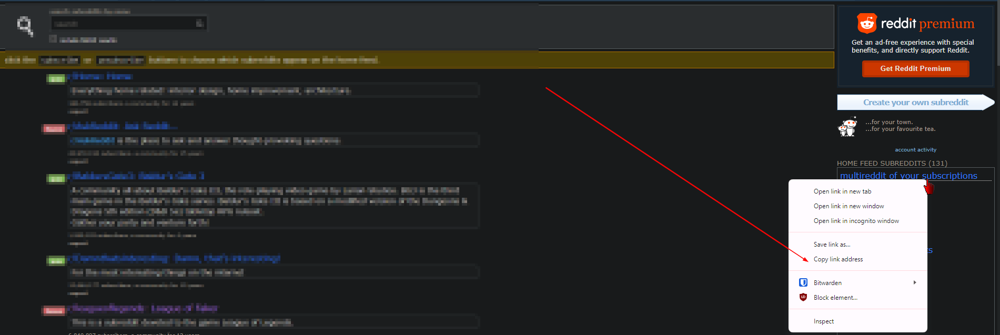

Karma is a tool designed to facilitate an easier and more efficient way for you to join subreddits on Reddit from a fresh account (without the use of the Reddit API).

 _Please note that Karma has only been tested on Windows with the Chrome browser._

# Setup

### Users With Python Installed
1. `git clone` Karma.
   
2. Login to the main account that has all the subreddits you want to join and visit this [page](https://www.reddit.com/reddits).

3. Right-click "multireddit of your subreddits" and copy the URL: 

4. Replace "XXX" in the .env file located in the config folder with your credentials and the copied URL.

5. Verify that your Google Chrome browser is updated to the latest version.

6. Visit [Chrome Driver for Testing](https://googlechromelabs.github.io/chrome-for-testing/#stable) and download the stable Windows x64 version of ChromeDriver.

7. Once downloaded, extract the zip file to your preferred location.

8. Add the directory where ChromeDriver is located to your system's PATH.

9. `cd` into the directory where you cloned Karma to and run `pip install -r requirements.txt`.

10. Finally, run `py .\main.py`.

### Users Without Python Installed / Prefer To Run The EXE
1. Download the executable from https://github.com/Brimey/Karma/blob/main/dist/main.exe or https://github.com/Brimey/Karma/releases/tag/1.0.0 and place it in a directory of your choosing.

2. Windows might prompt you to trust it. Go ahead and trust it. [VirusTotal report](https://www.virustotal.com/gui/file/b60c5bee114558b7652467b18b4493c665fb5c53593fc0ba980a97e7039c37d4/detection) if needed. There were some false positives reported I believe.

3. In the same directory where the executable is, create a config folder, and create a [`.env` file](https://github.com/Brimey/Karma/blob/main/config/.env.example).

4. Repeat steps [three](https://github.com/Brimey/Karma/blob/main/README.md#:~:text=Login%20to%20the,copy%20the%20URL%3A) and [four](https://github.com/Brimey/Karma/blob/main/README.md#:~:text=Replace%20%22XXX%22%20in%20the%20.env%20file%20located%20in%20the%20config%20folder%20with%20your%20credentials%20and%20the%20copied%20URL.).

5. Run the executable.
